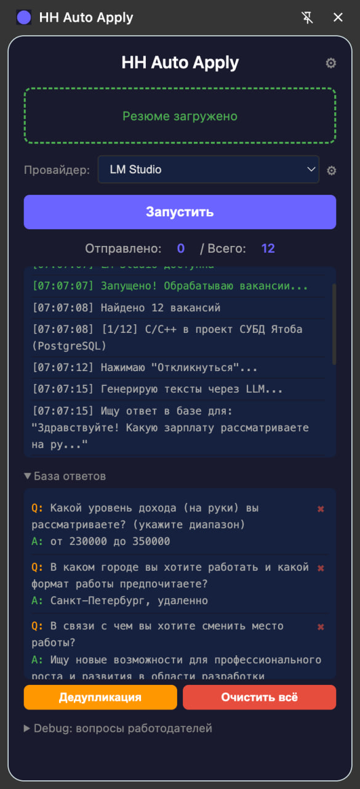
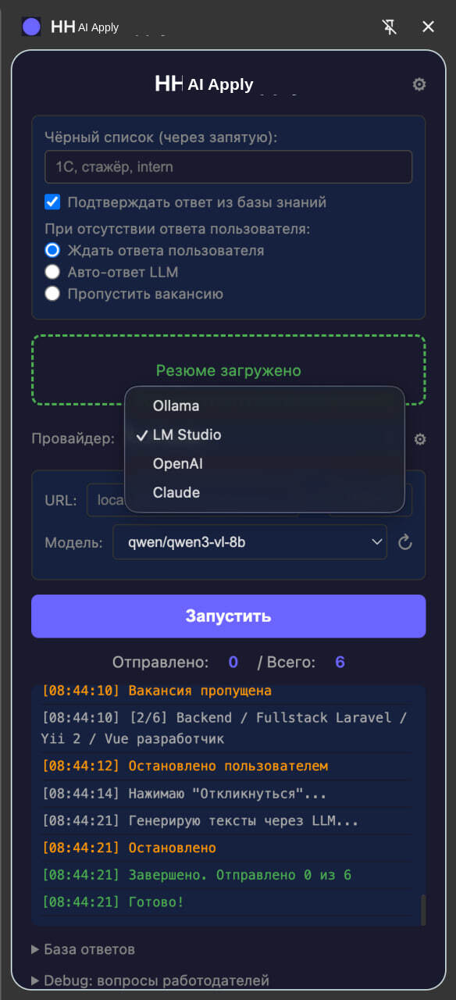
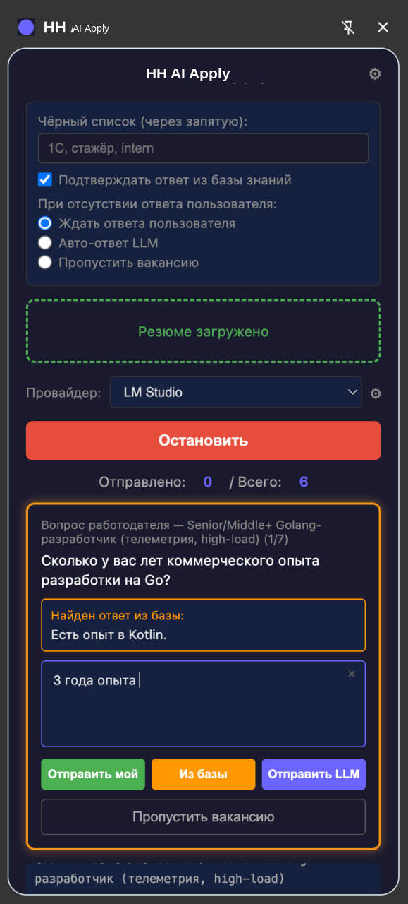

# HH Auto Apply

Chrome-расширение для автоматической отправки откликов на вакансии hh.ru с генерацией ответов через LLM.



## Возможности

- **Автоматический обход вакансий** — собирает вакансии со страницы поиска hh.ru и последовательно откликается на каждую
- **Генерация ответов через LLM** — автоматически отвечает на вопросы работодателя, используя информацию из резюме
- **Генерация сопроводительных писем** — создаёт персонализированное письмо на основе описания вакансии и резюме
- **База знаний** — сохраняет пары вопрос-ответ и переиспользует их для аналогичных вопросов в будущем
- **Дедупликация через LLM** — объединяет похожие вопросы в базе знаний
- **Чёрный список** — фильтрация вакансий по ключевым словам в названии и описании
- **Мульти-провайдер** — поддержка Ollama, LM Studio, OpenAI, Claude

## Настройки



### Провайдеры LLM

| Провайдер | Тип | API Key |
|-----------|-----|---------|
| Ollama | Локальный | Не требуется |
| LM Studio | Локальный | Не требуется |
| OpenAI | Облачный | Требуется |
| Claude | Облачный | Требуется |

### Общие настройки

- **Чёрный список** — слова через запятую для фильтрации вакансий (например: `1C, стажёр, intern`)
- **Подтверждать ответ из базы знаний** — если включено, ответы из базы показываются для подтверждения; если выключено — используются автоматически
- **При отсутствии ответа пользователя:**
  - Ждать ответа пользователя — бот останавливается и ждёт
  - Авто-ответ LLM — по таймауту автоматически использует ответ LLM
  - Пропустить вакансию — по таймауту пропускает вакансию

## Диалог с вопросом работодателя



При получении вопроса от работодателя доступны варианты:
- **Отправить мой** — ввести и отправить свой ответ
- **Из базы** — использовать найденный ответ из базы знаний
- **Отправить LLM** — сгенерировать ответ через LLM
- **Пропустить вакансию** — пропустить текущую вакансию

## Установка

1. Скачайте или клонируйте репозиторий:
   ```bash
   git clone https://github.com/wyaredaze/hh-auto-apply.git
   ```
   или нажмите **Code → Download ZIP** и распакуйте архив
2. Откройте в браузере `chrome://extensions/`
3. Включите **Режим разработчика** (переключатель в правом верхнем углу)
4. Нажмите **Загрузить распакованное расширение**
5. Выберите папку проекта (`hh-auto-apply`)
6. Расширение появится в списке — откройте боковую панель, нажав на иконку расширения на любой странице hh.ru

## Использование

1. Загрузите PDF-резюме через drag & drop
2. Выберите провайдер и модель LLM
3. Откройте страницу поиска вакансий на hh.ru
4. Нажмите "Запустить"
